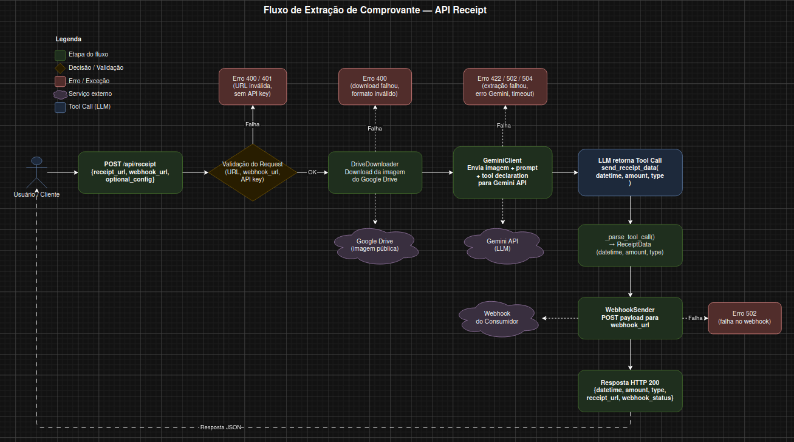

# 📄 Guia de Uso — API de Extração de Comprovantes com Gemini

## Variáveis de Ambiente

| Variável         | Obrigatória | Descrição                                    |
|------------------|-------------|----------------------------------------------|
| `GEMINI_API_KEY` | Sim         | Chave de autenticação da API do Google Gemini |

```bash
export GEMINI_API_KEY="sua-chave-aqui"
```

> ⚠️ Nunca versione a chave. Adicione `.env` ao `.gitignore`.

---

## Instalação

```bash
pip install -r requirements.txt
```

---

## Subindo a API

```bash
uvicorn src.main:app --env-file .env --host 0.0.0.0 --port 8000
```

A API estará disponível em `http://localhost:8000`.

---

## Endpoint

### `POST /api/receipt`

Envia uma imagem de comprovante financeiro (via URL pública do Google Drive) para extração de dados e classificação automática como income ou expense.

### Request

```json
{
  "receipt_url": "https://drive.google.com/file/d/SEU_FILE_ID/view?usp=sharing",
  "webhook_url": "https://webhook.site/seu-endpoint",
  "optional_config": {
    "gemini_api_key": "sua-chave-alternativa",
    "llm_model": "gemini-2.5-flash",
    "max_tokens": 2048
  }
}
```

| Campo             | Tipo   | Obrigatório | Descrição                                     |
|-------------------|--------|-------------|------------------------------------------------|
| `receipt_url`     | string | Sim         | URL de compartilhamento público do Google Drive |
| `webhook_url`     | string | Sim         | URL que receberá os dados extraídos via POST    |
| `optional_config` | object | Não         | Configurações opcionais da LLM (ver abaixo)     |

> A imagem no Google Drive **deve estar com compartilhamento público** ("Qualquer pessoa com o link").

---

### `optional_config`

Objeto opcional que permite sobrescrever as configurações padrão da LLM por requisição. Quando omitido ou `null`, a API usa os valores padrão do servidor.

```json
{
  "gemini_api_key": "sua-chave-alternativa",
  "llm_model": "gemini-2.5-flash",
  "max_tokens": 2048
}
```

| Campo            | Tipo    | Default                          | Descrição                                                  |
|------------------|---------|----------------------------------|------------------------------------------------------------|
| `gemini_api_key` | string  | Valor da env var `GEMINI_API_KEY`| Chave da API do Gemini a ser usada nesta requisição        |
| `llm_model`      | string  | `gemini-2.0-flash`               | Modelo da LLM a ser utilizado                              |
| `max_tokens`     | integer | `4096`                           | Número máximo de tokens na resposta da LLM                 |

#### Regras de negócio

- **`gemini_api_key`**: quando informada, a requisição utiliza essa chave em vez da chave configurada na variável de ambiente `GEMINI_API_KEY`. Isso permite que cada consumidor use sua própria chave/quota. Se o valor for `null`, vazio ou omitido, a chave da env var é utilizada. Se **nenhuma** das duas existir (env var vazia e campo não informado), a API retorna `401`.

- **`llm_model`**: define qual modelo do Gemini será usado para analisar o comprovante. Quando omitido ou `null`, usa o modelo padrão `gemini-2.0-flash`. Útil para escolher modelos mais potentes (ex: `gemini-2.5-pro`) quando a imagem exige maior capacidade de interpretação, ou modelos mais leves para reduzir custo/latência.

- **`max_tokens`**: limita o número máximo de tokens que a LLM pode gerar na resposta. Quando omitido ou `null`, usa o padrão de `4096`. Valores menores reduzem custo e latência; valores maiores podem ser necessários para comprovantes com muitos detalhes.

---

### Response — Sucesso (200)

```json
{
  "datetime": "2026-03-15T14:30:00",
  "amount": 187.50,
  "type": "expense",
  "receipt_url": "https://drive.google.com/file/d/SEU_FILE_ID/view?usp=sharing",
  "webhook_status": "sent"
}
```

### Erros

| HTTP | Cenário                                              |
|------|------------------------------------------------------|
| 400  | URL ausente, formato inválido ou não é Google Drive  |
| 400  | `webhook_url` ausente ou inválida                    |
| 400  | Falha no download da imagem (arquivo privado/quebrado)|
| 401  | Nenhuma `GEMINI_API_KEY` disponível (env var nem request) |
| 422  | Gemini não conseguiu extrair dados do comprovante    |
| 429  | Rate limit da API do Gemini                          |
| 502  | Erro do Gemini ou falha ao enviar para o webhook     |
| 504  | Timeout na comunicação com o Gemini                  |

---

## Exemplos de Chamada

### cURL — request básico (sem optional_config)

```bash
curl -X POST http://localhost:8000/api/receipt \
  -H "Content-Type: application/json" \
  -d '{
    "receipt_url": "https://drive.google.com/file/d/SEU_FILE_ID/view?usp=sharing",
    "webhook_url": "https://webhook.site/seu-endpoint"
  }'
```

### cURL — com optional_config

```bash
curl -X POST http://localhost:8000/api/receipt \
  -H "Content-Type: application/json" \
  -d '{
    "receipt_url": "https://drive.google.com/file/d/SEU_FILE_ID/view?usp=sharing",
    "webhook_url": "https://webhook.site/seu-endpoint",
    "optional_config": {
      "gemini_api_key": "sua-chave-alternativa",
      "llm_model": "gemini-2.5-pro",
      "max_tokens": 2048
    }
  }'
```

### Python (httpx)

```python
import httpx

response = httpx.post(
    "http://localhost:8000/api/receipt",
    json={
        "receipt_url": "https://drive.google.com/file/d/SEU_FILE_ID/view?usp=sharing",
        "webhook_url": "https://webhook.site/seu-endpoint",
        "optional_config": {
            "llm_model": "gemini-2.5-flash",
        },
    },
)
print(response.json())
```

---

## Formatos de Imagem Aceitos

Apenas **JPEG** e **PNG**. Outros formatos serão rejeitados com erro 400.

---

## Dicas

- Use o [webhook.site](https://webhook.site) para testar o recebimento dos dados extraídos.
- Imagens com boa resolução e texto legível geram melhores resultados.
- A classificação (income/expense) é feita pelo LLM — em caso de dúvida, revise manualmente.
- Use `optional_config` para testar diferentes modelos sem alterar a configuração do servidor.

## Fluxograma do projeto

